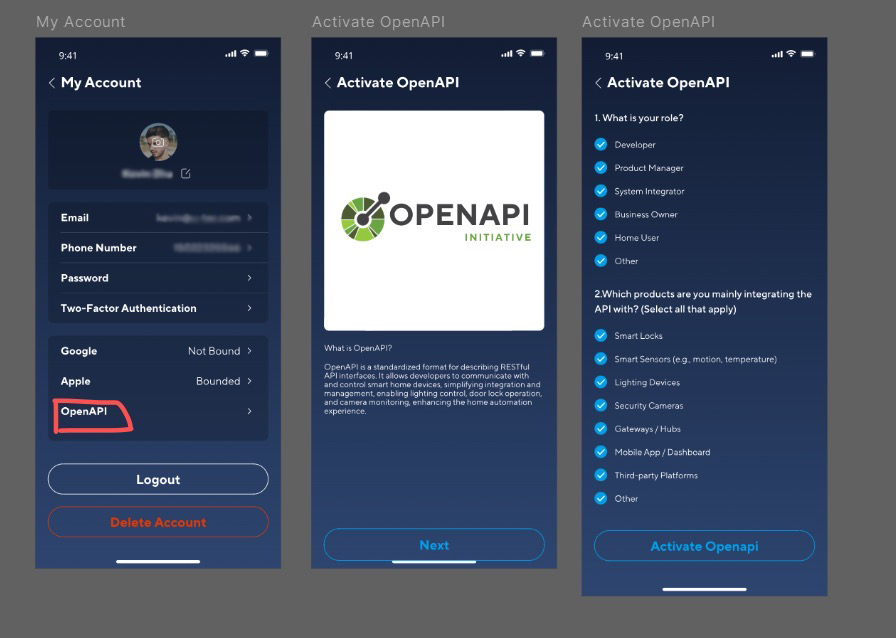
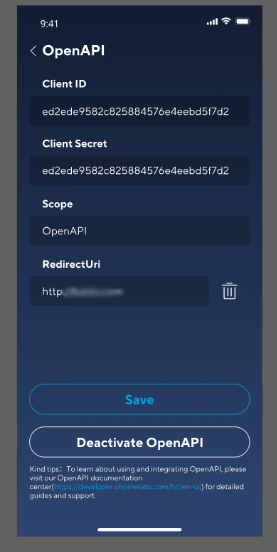

# Uhome (U-Tec) Home Assistant Integration

A Home Assistant integration for U-Tec smart home devices via the Uhome API that allows you to control your locks, lights, switches, and sensors through Home Assistant.

## Device Types
- Supports multiple U-tec device types:
    - Locks
    - Lights
    - Switches
    - Smart Plugs (Wifi)
 
### Features
- Secure API communication
- Locking and unlocking
- Lock states
- Door states
- Battery levels
- Switch on and off (Lightbulbs use the switch capabilitiy for some reason, so at very least they should have rudimentary functionality)
- SwitchLevel (Honestly, idk what this is actually for, but hopefully we can use it to control light brightness until they properly implement light controls)

## Limitations
- Currently the Utec API doesn't support the following devices:
	- Wifi bridge modules
	- Air Portal registration / devices

## Requirements
- API Credentials
- External Access Configured (ie., Nabu Casa)

## Getting Your Credentials
#### Having your credentials is nessecary to configure the integration, so get them before you install it.

API credentials are now available directly in the Xthings Home app (formerly U-Home) version 3.5.5 or later. No need to submit a request through the developer portal.

1. Open the Xthings Home app and go to **My Account**
2. Tap **OpenAPI**
3. Follow the prompts to activate OpenAPI — select your role and the products you are integrating with, then tap **Activate Openapi**

Once activated, you will see your `Client ID`, `Client Secret`, `Scope`, and `RedirectUri`.
- Set `RedirectUri` to `https://my.home-assistant.io/redirect/oauth`
- Confirm `Scope` is set to `OpenAPI`
- Tap **Save**

For the integration you will need `Client ID` and `Client Secret`.

For more information, see the [Developer API Documentation](https://doc.api.u-tec.com/#intro). If you run into issues with the API, you can [submit a support request](https://developer.xthings.com/hc/en-us/requests/new).

*See [issue #36](https://github.com/LF2b2w/Uhome-HA/issues/36) for more details. Screenshots courtesy of @geofox784.*

## Installation
### HACS (Recommended)
Open HACS in your Home Assistant instance\
Click add custom repo\
Paste the URL of this repo and choose type integration\
Search for "U-tec"\
Click "Install"
#### Set up redirect URI in Uhome app
In the Uhome app, in the *Develop Console* tab - \
    Set redirect URI - `https://my.home-assistant.io/redirect/oauth`\
Note: Enter this url exactly as it is here. Do not replace the hostname with your own home assistant.

### Manual Installation
Download the repository\
Copy the custom_components/Homeassistant-utec folder to your Home Assistant's custom_components directory\
Restart Home Assistant

## Configuration
In Home Assistant, go to Configuration > Integrations\
Click the "+" button to add a new integration\
Search for "U-Tec"\
You will need to provide this information from the U-Home mobile app under Settings -> Develop Console :
- Client ID
- Client Secret
- API Scope (default: 'openapi')

## Troubleshooting
See [FAQ](https://github.com/LF2b2w/Uhome-HA/discussions/2)
    
## Contributing
Contributions are welcome! Please feel free to submit a Pull Request.

#### License
This project is licensed under the MIT [License](./LICENSE).

Support
If you encounter any issues or have questions: Check the [Issues](https://github.com/LF2b2w/Uhome-HA/issues) page
Create a new issue if your problem isn't already reported

[Join](https://github.com/LF2b2w/Uhome-HA/discussions) the discussion in the Home Assistant community forums
---
Made with ❤️ by @LF2b2w
